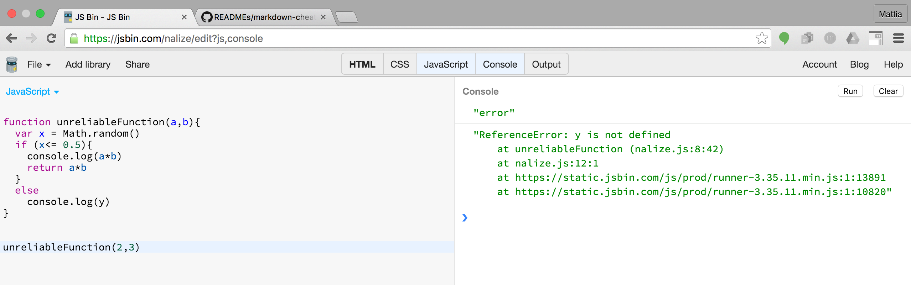
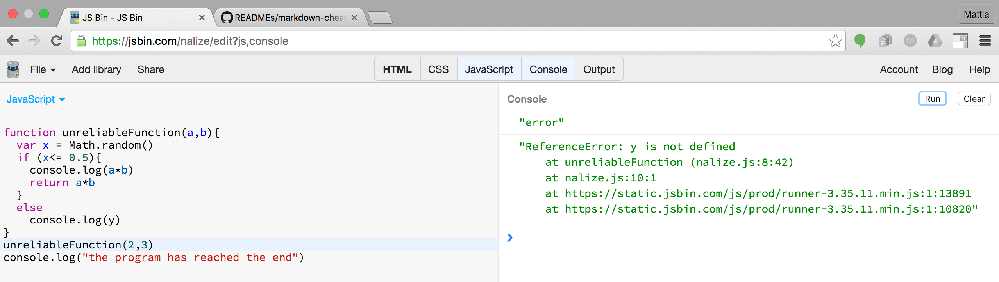
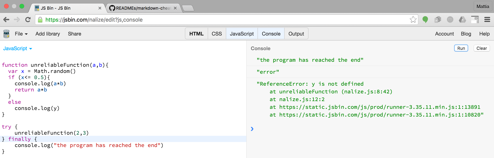

# Working with exceptions

##Intro
This readme will cover the usage of the following functions: throw, try, catch, finally:

## Why is exception handling useful
Exceptions are a way to deal with errors that can occur when your code is executed.  

To explain the concept I will start with a simple example.  
```javascript
function unreliableFunction(a,b){  
  var x = Math.random()  
  if (x<= 0.5){  
    console.log(a*b)  
    return a*b  
  }  
  else  
    console.log(y)  
}  
```  

This function is an unrealible one. When invoked, half of the times it will return the products of the 2 parameters. The rest of the times it will try to log in the console the value y. Since y was not declared anywhere, this will cause an error. In this case the error is handled by the environment and I will see something like this as output:



In this case, where I have a single function in my program, it doesn't create big problem. But what would happen if this function was part of a bigger program? If the unreliableFunction fails, the code that comes after the function call would not be executed. See this example:
 
```javascript
function unreliableFunction(a,b){  
  var x = Math.random()  
  if (x<= 0.5){  
    console.log(a*b)  
    return a*b  
  }  
  else  
    console.log(y)  
}  
unreliableFuncion(2,3)
console.log("the program has reached the end")
```  

Fifty percent of the times, whenthe unreliableFunction doesn't fail this will be the output:


When the unreliableFunction returns the product this will be the output. You can see that the code following the function call has been executed:



It may be the case that the last line of code is essential to my program, so how do I make sure that it is executed even if the function fails? In javascript I can use the construct try{}...finally{}
```javascript
function unreliableFunction(a,b){  
  var x = Math.random()  
  if (x<= 0.5){  
    console.log(a*b)  
    return a*b  
  }  
  else  
    console.log(y)  
}  
try {
    unreliableFuncion(2,3)
} finally{
    console.log("the program has reached the end")
}
```  
if the unreliableFunction doesn fail the output will be as before. Instead when it fails I will see something like this:


As you can see the last line of the code has beed executed even if the function before failed. There is an important observation to make at this point. Why is the error sent to the console after the last line of the program is executed? Understanding the answer to this question is at the core of understanding how exception works in JS. Before answering the question I will show you a different example where the error message is displayed in the console **before** the last line of code is executed:

```javascript
function unreliableFunction(a,b){  
  var x = Math.random()  
  if (x<= 0.5){  
    console.log(a*b)  
    return a*b  
  }  
  else  
    console.log(y)  
}  
try {
    unreliableFuncion(2,3)
} catch(e) {
    console.log(e.message)   
} finally{
    console.log("the program has reached the end")
}
```

This will utput the following:
[img5](img/s5.png)

When something goes wrong inside unrealiableFunction JS will raise an exception. In practical terms, an exception is a value.  JS will create a new Object using the constructor Error, and it will assign to Error.message the type of error that was encoutered. In this case "y is not defined".  Raising an exeption is somewhat similar to a _return_ from a function. In the case of an exception the program will jump out of the  current function and also of all the functions that came before in the execution stack. This is called _unwinding the stack_. When this happens the exception traverse the execution stack and if nothing intercept it, it is handled by the environment. This is why in the forlast example the error message was displayed **after** the last line of code was run. It was the environment that output that error message to console, after the code in the finally block was executed.

However, leaving an exception to the environment is not the only way possible.I could tell the code, to "catch" an exception and to deal with it from inside the code, without exiting the program. This is what happend inside the last example and it is accomplished by this bit of code:  
```javascript
} catch(e) {
    console.log(e.message)   
}
```


